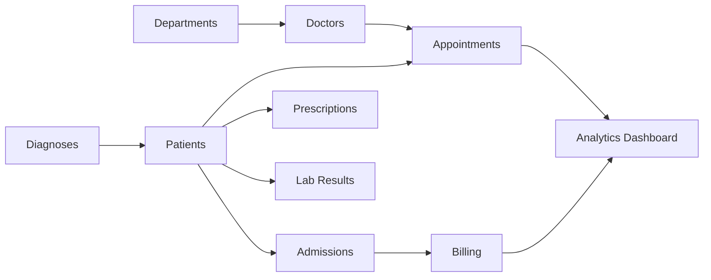

<div align="center">

# 🏥 Healthcare Analytics Database

### Enterprise Hospital Management & Healthcare Intelligence Platform

*A production-inspired MySQL database that models hospital operations through advanced relational design, healthcare analytics, operational reporting, and business intelligence dashboards.*


</div>

---

# 📖 Overview

Healthcare systems generate enormous volumes of interconnected data every day—from patient admissions and appointments to prescriptions, laboratory results, and billing records.

This project simulates the backend database architecture of a modern hospital information system, demonstrating advanced relational modeling, data integrity, operational reporting, and healthcare analytics using MySQL.

Rather than simply storing records, the database is designed to support real-world hospital operations through reusable reporting queries and business intelligence dashboards.

---

# ✨ Core Features

## 👨‍⚕️ Hospital Operations

- Patient Management
- Doctor Management
- Department Administration
- Appointment Scheduling
- Hospital Admissions
- Prescription Tracking
- Laboratory Management
- Billing & Insurance

---

## 📊 Healthcare Analytics

Generate operational insights including:

- Doctor Workload
- Revenue Analysis
- Patient Satisfaction Metrics
- Medication Usage
- Hospital Occupancy
- Appointment Performance
- Billing Statistics
- Laboratory Monitoring

---

## 🛡 Enterprise Data Integrity

The database enforces healthcare data consistency using:

- Foreign Key Relationships
- Referential Integrity
- ENUM Data Types
- Validation Constraints
- Controlled Medical Reference Tables

Critical business rules are enforced directly inside the database to maintain reliable medical records.

---

# 🏗 Database Architecture



---

# 🗄 Database Schema

| Table | Description |
|--------|-------------|
| **departments** | Hospital departments and facilities |
| **doctors** | Doctor profiles, specialties, consultation fees |
| **patients** | Patient demographics, insurance, medical history |
| **diagnoses** | ICD-10 diagnosis reference data |
| **medications** | Medication catalog and pricing |
| **appointments** | Patient appointments and visit history |
| **admissions** | Hospital admissions and discharge records |
| **patient_diagnoses** | Patient diagnosis history |
| **prescriptions** | Medication prescriptions issued by doctors |
| **lab_tests** | Laboratory test catalog |
| **lab_results** | Patient laboratory results |
| **billing** | Billing, insurance coverage, and payment records |

---

# 📈 Analytics Engine

The reporting layer provides actionable healthcare insights for administrators and hospital management.

### 👨‍⚕️ Doctor Performance

- Daily Workload
- Appointment Counts
- Admissions
- Prescription Activity

---

### 💰 Revenue Dashboard

Analyze:

- Daily Revenue
- Weekly Revenue
- Monthly Revenue
- Insurance Coverage
- Outstanding Patient Payments

---

### 💊 Medication Intelligence

Monitor medication demand using automated classifications:

- LOW USAGE
- ACTIVE – MONITOR
- HIGH USAGE – RESTOCK

---

### 😊 Patient Experience

Measure operational KPIs including:

- Appointment Completion Rate
- Average Hospital Stay
- Medication Adherence
- Patient Satisfaction Indicators

---

### 📅 Appointment Monitoring

Track:

- Upcoming Appointments
- Completed Visits
- Missed Appointments
- Department Scheduling

---

### 🔍 System Health Checks

Automatically identify:

- Orphan Records
- Missing Billing Entries
- Pending Laboratory Results
- Data Integrity Issues

---

# 🚀 SQL Concepts Demonstrated

- Relational Database Design
- Primary & Foreign Keys
- Complex Joins
- Aggregate Reporting
- CASE Expressions
- ENUM Data Types
- Conditional Analytics
- Healthcare KPI Reporting
- Business Intelligence Queries
- Operational Dashboards

---

# 🛠 Technology Stack

| Layer | Technology |
|--------|------------|
| Database | MySQL 8 |
| Language | SQL |
| Reporting | Analytical SQL |
| Validation | Constraints & Foreign Keys |
| Analytics | Aggregate Queries |
| Business Intelligence | Dashboard Queries |

---

# 📂 Project Structure

```
Healthcare-Analytics-Database
│
├── healthcare_analytics.sql
└── README.md
```

---

# 📊 Project Highlights

| Feature | Included |
|----------|-----------|
| Relational Database Design | ✅ |
| Healthcare Data Modeling | ✅ |
| Operational Analytics | ✅ |
| Revenue Dashboard | ✅ |
| Doctor Workload Reporting | ✅ |
| Patient Management | ✅ |
| Billing Analytics | ✅ |
| Laboratory Monitoring | ✅ |
| Business Intelligence Queries | ✅ |

---

# 🎯 What This Project Demonstrates

- Advanced SQL Development
- Enterprise Database Design
- Healthcare Data Modeling
- Operational Reporting
- Business Intelligence
- Data Integrity
- Performance-Oriented SQL
- Hospital Information Systems

---

# ⚙ Getting Started

Clone the repository:

```bash
git clone https://github.com/your-username/Healthcare-Analytics-Database.git
```

Open **healthcare_analytics.sql** in MySQL Workbench and execute the complete script.

The script automatically:

- Creates the database
- Builds the schema
- Applies relationships
- Inserts realistic sample data
- Executes analytical reports
- Generates dashboard-ready outputs

---

# 📊 Dashboard Ready

The generated queries can directly support healthcare dashboards for:

- 👨‍⚕️ Doctor Performance
- 💰 Revenue Analytics
- 💊 Medication Monitoring
- 📅 Appointment Tracking
- 🏥 Hospital Operations
- 📈 Executive KPI Reporting

---

# 💡 Why This Project?

Healthcare databases demand accuracy, consistency, and reliable reporting.

This project demonstrates how relational database engineering can support hospital operations through well-designed schemas, strong data integrity, reusable analytics, and production-inspired SQL reporting that mirrors the needs of modern healthcare organizations.
